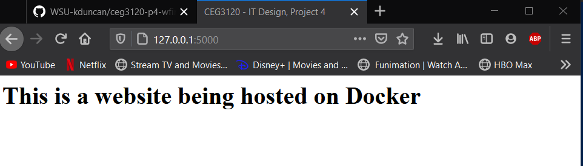

# Project Overview

## Run Project Locally

First thing I did was install Docker through the website provided in the project folder
[Docker](https://www.docker.com/products/docker-desktop)

Next thing is that I created an html folder inside the repository 

After that I created the DockerFile in order to get my html website in the Docker container

Commands that I used to get the DockerFile to work correctly were: `docker build nginix .` to build the container, and `docker run -d -p 5000:80 nginix` to run the container.

The address to get the the website to show up is the website followed by a colon and the port, which is `127.0.0.1:5000`

I also used this [website](https://hub.docker.com/_/httpd) for help on getting Docker to work

Here is proof of my docker working 

## Configure AWS CLI

I was able to get the credentials from the AWS console which had an access key and a secret access key and also a session token.

I installed the AWS CLI on WSL2 by using the following command: `sudo curl "https://awscli.amazonaws.com/awscli-exe-linux-x86_64.zip" -o "awscliv2.zip"` which downloaded the needed zip files needed 
I used `unzip awscliv2.zip` to unzip the files 
and `sudo ./aws/install` to actually install the CLI

The configuration settings I had used were provided as a link in the project description
`aws configure
AWS Access Key ID [None]: example1
AWS Secret Access Key [None]: example 2
Default region name [None]: us-west-2
Default output format [None]: json`
I just changed the values of the access key ID and the secret access key with the keys that I got from the AWS website

## Dockerhub Public Repo

In order to create a Dockerhub public repo, all you need is to create a Dockerhub account and just create a repo on the website, and give it a name.

## Configure GitHub Secrets

The github secrets were fairly easy, in the settings of your github account you can add a secret under one of the tabs. 

The only thing you need for the secrets are your DockerHub username and password.

I added 3 keys, one for my DockerHub username, one for my DockerHub password, and one for the authenication token from DockerHub. 

## Configure GitHub Workflow

The variables that I needed to change in the github workflow were 
